# File 51: Hyper-Scale 90-Day Sprint & 10-Person Team Scaling Playbook

> [!IMPORTANT]
> **Strict Scaling Policy**: In accordance with executive instructions, **this hyper-scale roadmap operates under our local staging policy**. All recruitment sourcing, structured interview schedules, and 90-day time-blocked hiring pipelines are fully staged and prepared for immediate deployment to scale our team from 1 to 10 people.

## I. The Hyper-Scale 90-Day Sprint Roadmap

To take Save Our Streams Inc. from a single-operator startup to a dominant 10-person geomorphic engineering and mitigation capital powerhouse, we establish **The Hyper-Scale 90-Day Sprint**. This roadmap leverages parallel workstreams to compress standard 12-month development timelines into tight, highly accountable 30-day blocks:

```mermaid
gantt
    title Hyper-Scale 90-Day Sprint Roadmap
    dateFormat  X
    axisFormat %d
    section Days 1-30: Sourcing
    1,000 Prospect CRM Sync      :active, a1, 0, 10
    Sign 5 Land JV Options      :active, a2, 5, 25
    Launch SEO Siting Outreach   :a3, 10, 30
    section Days 31-60: Engineering
    Hire Fluvial PE & UAS Drone  :active, b1, 30, 45
    HEC-RAS 2D & PCN Permit Filings :b2, 35, 60
    LinkedIn Cinematic Video Loop:b3, 40, 60
    section Days 61-90: Scale & Capital
    Hire Grading Crew & Office Controller: active, c1, 60, 75
    AgSouth / QTS Credit Sales Close :c2, 65, 85
    Weekly EOS Scorecard Alignments :c3, 60, 90
```

### 1. Days 1–30: The Sourcing Sprint (Target Team: 1 to 3 People)
- **Primary Focus**: Build the transaction engine, secure initial land options, and segment the CRM prospecting pipelines.
- **Hiring Milestones**: Managing Director (Hunter Morris), Sourcing Director, and rotating UGA Warnell GIS Intern.
- **Weekly Sourcing Rhythms**:
  - *Monday Morning CRM Import*: Segment and upload all 1,000 prospects and 100 Large River Tracts into self-hosted Corteza CRM.
  - *15 Sourcing Calls/Day*: Target priority landowners near Hunter's cabin (e.g. Tract `LT-006` Boardtown Creek, `LT-048` Fightingtown Creek).
  - *SEO Outreach*: Send backlink pitches to target Trout chapters (.org) and exurban banking blogs (.com) to establish organic site authority (File 49).
- **Success Target**: **Five (5) signed 70/30 Landowner Joint-Venture Option Agreements**; live segmented CRM dashboard; completed high-authority do-follow backlink placements.

### 2. Days 31–60: The Fluvial Engineering Sprint (Target Team: 3 to 6 People)
- **Primary Focus**: Transition from sourcing into high-speed technical permitting and geomorphic Natural Channel Design (NCD).
- **Hiring Milestones**: Onboard Fluvial Engineer (PE), UAS Drone Photogrammetry Specialist, and Restoration Biologist (UGA/GT graduates).
- **Weekly Engineering Rhythms**:
  - *LiDAR Drone Surveys*: Run Mavic 3 Enterprise photogrammetry wades over signed tracts, establishing QGIS NDVI canopy benchmarks.
  - *HEC-RAS 2D Siting*: Model 100-year storm floodway shear stresses ($1.46\text{ N/m}^2 < \tau < 21.85\text{ N/m}^2$) to prove gravel stability (File 33).
  - *USACE PCN Permitting*: Submit Section 404 Nationwide Permit 27 narratives and DNR trout buffer variances.
  - *LinkedIn Video Launch*: Distribute cinematic trout legacy documentaries (File 47) targeting data center ESG managers and developers.
- **Success Target**: **Three (3) submitted USACE NWP 27 Pre-Construction Notifications**; completed 3D AutoCAD NCD bioengineered designs for J-hook vanes; completed brand video distributions.

### 3. Days 61–90: The Siting & Capital Sprint (Target Team: 6 to 10 People)
- **Primary Focus**: Scale heavy civil construction, close wholesale credit pre-sales, and formalize board governance.
- **Hiring Milestones**: Onboard instream Grading Foreman, heavy equipment field hand, Office Controller/Bookkeeper, and Clemson Finance Intern.
- **Weekly Operations Rhythms**:
  - *Excavation Grading*: Mobilize John Deere 130G excavators to install toe-wood bank stabilization layers and J-hook riffles.
  - *Wholesale Credit Presales*: Close direct watershed transactions with QTS Data Centers, Microsoft Cloud, and Georgia DOT.
  - *QuickBooks Accounting Sync*: Establish 10% Escrow Working Capital reserves and distribute initial JV splits (File 37).
  - *EOS L10 Board Meetings*: Conduct bi-monthly board accountability cycles utilizing Vern Harnish's *Scaling Up* cash stress-testing models.
- **Success Target**: **$500,000+ credit pre-sale contracts executed**; heavy excavators active on two sites; fully synchronized QuickBooks Online chart of accounts; completed first intern rotation.

---

## II. The 10-Person Recruitment & Hiring Funnel

To scale our team with high-caliber talent without burning cash, we establish a **Structured, Non-Union Recruitment Funnel** targeting Georgia's elite academic institutions and specialized grading networks:

### 1. Recruiting Channels & Target Degrees
1. **Fluvial Engineer PE (Month 2)**: Target Georgia Tech School of Civil & Environmental Engineering (ce.gatech.edu). Look for candidates with 4+ years of HEC-RAS 2D modeling and USACE Section 404 permitting experience.
2. **Restoration Biologist (Month 2)**: Target University of Georgia Warnell School of Forestry & Natural Resources (warnell.uga.edu). Focus on EPA Rapid Bioassessment Protocols (RBP) III and benthic EPT taxonomic index expertise.
3. **Stewardship & Sourcing Interns (Month 1/3)**: Target Clemson Master of Real Estate Development (MRED) and agricultural wealth programs to manage RIBITS market sourcing and bank option agreements.
4. **Instream Grading Foreman (Month 3)**: Recruited directly from local Fannin/Gilmer county heavy civil contracting databases (Yancey Caterpillar logistics reps, forestry clearing foremen).

### 2. Structured 3-Step Interview Funnel
- **Step 1: Geomorphic Screen (Hunter Morris)**: 30-minute phone call assessing alignment with local mountain trout ecosystems and geomorphic conservation values.
- **Step 2: Technical Geomorphic Test**: Candidate is given raw GIS/elevation coordinates of a degraded reach (e.g. Sandra's Cabin Boardtown Creek scours) and must calculate the Entrenchment Ratio ($ER$) and recommend J-hook structures within 48 hours.
- **Step 3: Board Alignment (Hunter & Hadi Irvani)**: In-person alignment review at the operations office, assessing cultural fit, EOS scorecard metrics, and long-term legacy commitments.

### 3. Roles and Responsibilities Matrix
| Employee ID | Role / Seat | Key Responsibilities | Primary Performance KPI |
| :--- | :--- | :--- | :--- |
| **EM-01** | Managing Director (Hunter Morris) | Geomorphic design-build lead; Board relationship banking; direct credit sells. | Project IRR ($\ge 30\%$); JV contracts signed. |
| **EM-02** | Sourcing Director | Sourcing rural mountain landowner wades; exurban real estate broker relationships. | Landowner options signed ($\ge 3$/month). |
| **EM-03** | Fluvial Engineer PE | AutoCAD Civil 3D NCD structure designs; 1D/2D HEC-RAS hydraulic modeling. | USACE PCN permit approvals; zero design errors. |
| **EM-04** | Restoration Biologist | Benthic macroinvertebrate sorting; EPA Rapid Bioassessments; EPD variance filings. | Annual RIBITS monitoring reports submitted on-time. |
| **EM-05** | UAS Drone Specialist | photogrammetry demo mapping flight paths; GCP placements; WebODM processing. | LiDAR Dem mapping accuracy ($\ge 98\%$). |
| **EM-06** | instream Grading Foreman | John Deere excavator bankfull grading; toe-wood placement; step-pool installations. | Instream grading execution within budget. |
| **EM-07** | Heavy Equipment Field Hand | Silt fence setups; pump-around water bypass installations; cedar root-wad logging. | Worksite safety and GSWCC compliance ratings. |
| **EM-08** | Office Controller | QuickBooks Online chart of accounts; Docuseal signatures; Escrow reserves tracking. | Account balancing within 24 hours of close. |
| **EM-09** | UGA Warnell Intern | Macroinvertebrate sorting quadrants; HOBO logger temperature readings. | Complete vegetative quadrants surveys ($\ge 10$/week). |
| **EM-10** | Clemson Real Estate Intern | RIBITS database audit; exurban land zoning scans; exurban B2B database follow-ups. | Segmented target lead acquisitions ($\ge 50$/week). |

---

## III. High-Velocity EOS Scorecards & Alignment Rhythms

To ensure our scaled team operates at peak velocity without misalignments, we implement the **Traction EOS Weekly Alignment Rhythm**:

### 1. High-Velocity Scorecard Metrics
- **Weekly Sourcing Scorecard**: Track the exact volume of landowner calls ($\ge 75$/week), completed stream walks ($\ge 5$/week), and signed JV options ($\ge 1$/week) to maintain a healthy sourcing pipeline.
- **Weekly Engineering Scorecard**: Track the volume of AutoCAD sheets completed ($\ge 4$/week), LiDAR drone acres processed ($\ge 100$ acres/week), and regulatory submissions ($\ge 1$/month).
- **Weekly Capital & Siting Scorecard**: Track cash runway stress-testing, wholesale pre-sales pipeline (Target: $250k pending), andEscrow capital allocations (12.5% target balance).

### 2. High-Velocity Level 10 Board Meeting Agenda (90 Minutes)
1. **The Segue (5 Min)**: Share one personal and one professional win to set a positive, collaborative tone.
2. **The Scorecard (10 Min)**: Review the 10 role-based metrics to ensure all parameters are on-track.
3. **Rock Review (15 Min)**: Check progress on our high-priority 90-day sprint targets (Sign 5 JV options, submit 3 permits, secure pre-sales).
4. **Employee & Customer Headlines (5 Min)**: Share feedback from landowners, brokers, or regulatory inspectors.
5. **To-Do List (5 Min)**: Ensure last week's operational commitments are 100% completed.
6. **IDS - Identify, Discuss, Solve (45 Min)**: Deeply analyze and resolve the week's biggest roadblocks (e.g. a delayed EPD trout buffer variance or an exurban land mortgage bank subordination delay).
7. **Conclude & Rate (5 Min)**: Summarize new To-Dos, define external messaging limits, and rate the meeting on a scale of 1-10 (target: $\ge 8.5$).
