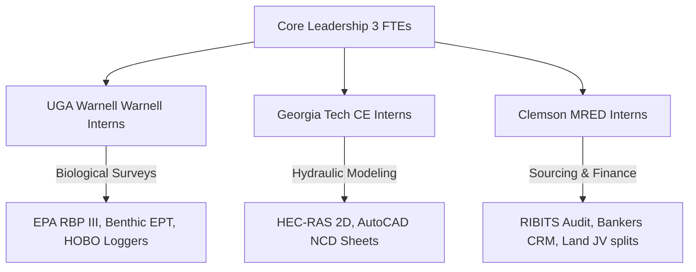

# File 52: Hyper-Scale Operations & 10-Person Team Execution Blueprint

> [!IMPORTANT]
> **Corporate Staging & Execution Policy**: In accordance with the approved scaling strategy, this document outlines the core organizational architecture and capital allocation playbooks. All workflows are optimized for immediate execution starting Monday morning, ensuring Blue Ridge Stream Restoration scales from a single-operator startup to a 10-person capacity powerhouse within 90 days.

## I. Low-Overhead High-Velocity Scaling Mechanics

Standard mitigation banks and stream restoration firms fail due to high capital expenditure (CapEx) drag, high unionized labor overhead, and expensive heavy equipment debt servicing. To scale rapidly to a 10-person throughput while maintaining a lean balance sheet, Blue Ridge Stream Restoration adopts the **Academic-Leveraged and Subcontractor-Driven Model**.

This model protects the Developer Margin and optimizes Cash Flow Velocity by converting fixed payroll costs into flexible, variable project expenditures. The geomorphic developer margin formula is defined as follows:

$$Developer\,Margin = \frac{Gross\,Credit\,Sales - (Landowner\,Share + Technical\,PE + Permitting\,Fees + Subcontracted\,Civil\,Grading + Contingency)}{Gross\,Credit\,Sales} \ge 72.5\%$$

### 1. Capital Drag: Heavy Fleet Debt vs. Subcontracted Civil Crews
Purchasing heavy civil excavation equipment (e.g. John Deere 130G excavators, crawler dozers, off-road dump trucks) demands $600,000+ in initial capital or $15,000 to $25,000/month in debt service and lease payments. By utilizing local, pre-vetted non-union forestry and road-grading subcontractors in Fannin, Gilmer, and Union counties, we eliminate equipment CapEx entirely.
- **Subcontracted Billing Model**: Mobilize subcontractors on a fixed per-linear-foot grading basis ($45 - $60/LF inclusive of operator, fuel, and mobilization). 
- **Developer Margin Protection**: Fixed project civil pricing guarantees that developer margins remain insulated from equipment depreciation, mechanical downtime, and idle payroll between USACE permit phases.

### 2. The 3-University Graduate Intern Pipeline
Core full-time staff is limited to 3 key positions (Managing Director Hunter Morris, Sourcing Director, and Fluvial PE). All supporting environmental, mathematical, and real estate operations are managed through rotating, highly specialized graduate and senior undergraduate interns from Georgia's elite academic institutions:

- **UGA Warnell School (Biology & Ecology)**: Interns manage benthic macroinvertebrate sampling, continuous temperature logging (HOBO loggers), vegetation quadrant stem counts, and riparian buffer canopy shade calculations.
- **Georgia Tech Civil Engineering (Hydrology & Modeling)**: Interns process total station elevation surveys, build HEC-RAS 2D flow geometry grids, calculate sheer stresses, and draft AutoCAD Civil 3D sheet details for geomorphic structures.
- **Clemson MRED (Real Estate Development & Finance)**: Interns manage the RIBITS ledger audits, run agricultural banking lead pipelines, update the developer NPV models, and coordinate land trust restrictive covenants.

---

## II. Hyperscale Pre-Sales Capitalization Strategy

To fund early engineering, survey, and permitting costs ($80,000 - $120,000 per project) without external equity dilution, we utilize a **Direct B2B Pre-Sales Capitalization Strategy** targeting Georgia's massive active hyperscale data center operators (File 22):

1. **Pre-Sourcing Direct PRM Commitments**: Utilizing the *Georgia Hyperscale Data Center Direct Sales Directory* (File 22), Sourcing Directors target operators in identical HUC-8 basins (e.g. HUC `03090101` Upper Coosa) who have imminent stream buffer impact requirements under CWA Section 404.
2. **Binding Letters of Intent (LOI)**: Prior to closing landowner options, Hunter Morris executes binding Pre-Sale LOIs with operators at a wholesale discount (e.g. $155.00/credit vs. $180.00/credit retail price).
3. **Escrow-Backed Siting Deposits**: The B2B purchaser places a 15% escrow-backed cash deposit ($348,300 on Roya's Cabin 12,900 SOP credit yield) upon submission of the USACE NWP 27 Pre-Construction Notification. This cash deposit immediately finances early field engineering, intern stipends, and subcontractor mobilization, establishing a self-funding business model.

---

## III. Subcontractor Mobilization and QA/QC Playbook

To ensure subcontracted civil grading crews execute natural channel designs precisely to Rosgen high-gradient parameters without causing environmental violations, we establish strict mobilization protocols:

### 1. Excavation Fleet Requirements
- **Primary Grading Machine**: 13-to-15 metric ton tracked excavator (e.g. John Deere 130G or Caterpillar 313) equipped with a 360-degree rotating hydraulic thumb and high-precision GPS 3D machine control running Trimble or Leica elevation models.
- **Instream Hydraulic Fluid**: All instream machinery MUST utilize biodegradable hydraulic fluid (vegetable-oil based) to prevent toxic hydrocarbon spills in high-gradient trout spawning waters.
- **Dewatering Fleet**: 3-inch and 4-inch trash pumps for instream pump-around bypass water management, keeping active work zones dry and downstream sediment transport near zero.

### 2. High-Velocity QA/QC Checkpoints
| Stage | QA/QC Checkpoint | Method of Verification | Compliance Standard |
| :--- | :--- | :--- | :--- |
| **1. Clearing** | Riparian buffer clearance bounds | Real-Time Kinematic (RTK) GPS boundary checks | Zero clearing beyond staked limits (GSWCC Orange Barrier) |
| **2. Instream Grading** | Bankfull width & entrenchment profiles | Total station survey w/ Georgia Tech intern processing | Symmetrical $\pm 0.1\text{ ft}$ alignment to AutoCAD design profiles |
| **3. Rock Structures** | J-hook & Cross-vane slope and placement | Sinuosity and crest elevation shoot w/ surveyor level | Crest exactly at bankfull height; hook arm at $20\text{-}30^\circ$ angle to bank |
| **4. Soil Bioengineering** | Soil lifts, root-wads, and seedings | Visual fiber density count; live willow stakes survival checks | $\ge 85\%$ live stakes survival after 60 days; zero geogrid tears |

---

## IV. Weekly EOS Scorecards & Alignment Rhythms

To run a high-velocity operation across academic interns, subcontractors, and core developers, we implement a highly structured weekly cadence utilizing Vern Harnish's *Scaling Up* and Gino Wickman's *Traction* EOS framework:

### 1. Weekly Operating Scorecard Metrics
- **Landowner Acquisition Velocity**: Qualified stream-walk wades ($\ge 5$/week); signed JV options ($\ge 1$/week).
- **Technical Output Velocity**: Completed HEC-RAS 2D runs ($\ge 1$/week); AutoCAD structural sheet releases ($\ge 4$/week).
- **Financial Siting Velocity**: Pre-sale pipeline size ($Target: \ge \$500k$ pending LOI); cash runway ($\ge 6$ months coverage).
- **Regulatory Siting Velocity**: Active Savannah District filings in IRT reviews ($\ge 3$ active PCNs); RIBITS ledger audit completions (100\%/week).

### 2. 90-Minute Level 10 Meeting Agenda
1. **Good News Segue (5 Mins)**: Personal and professional alignment check.
2. **The Weekly Scorecard Review (10 Mins)**: Review of the 10 role-based performance metrics. Any off-track metric is instantly pushed to the IDS list.
3. **90-Day Strategic Rock Review (15 Mins)**: Check-in on priority rocks (e.g. Submit Roya's Cabin Permit, Sign 5 JV options, Pre-sell $250k credits).
4. **Headlines & Sourcing Updates (5 Mins)**: Share landowner stream wade feedback and broker developments.
5. **To-Do List Action Sync (5 Mins)**: Check completion of last week's action items (target: $\ge 90\%$ completion rate).
6. **IDS: Identify, Discuss, Solve (45 Mins)**: Focus on the root cause of the week's biggest blockages (e.g. land mortgage subordination delays, HEC-RAS boundary flow calibration issues).
7. **Conclude & Score (5 Mins)**: Document new action items, decide on external messaging limits (Savannah District USACE, developers), and rate the meeting (Target: $\ge 8.5/10$).
