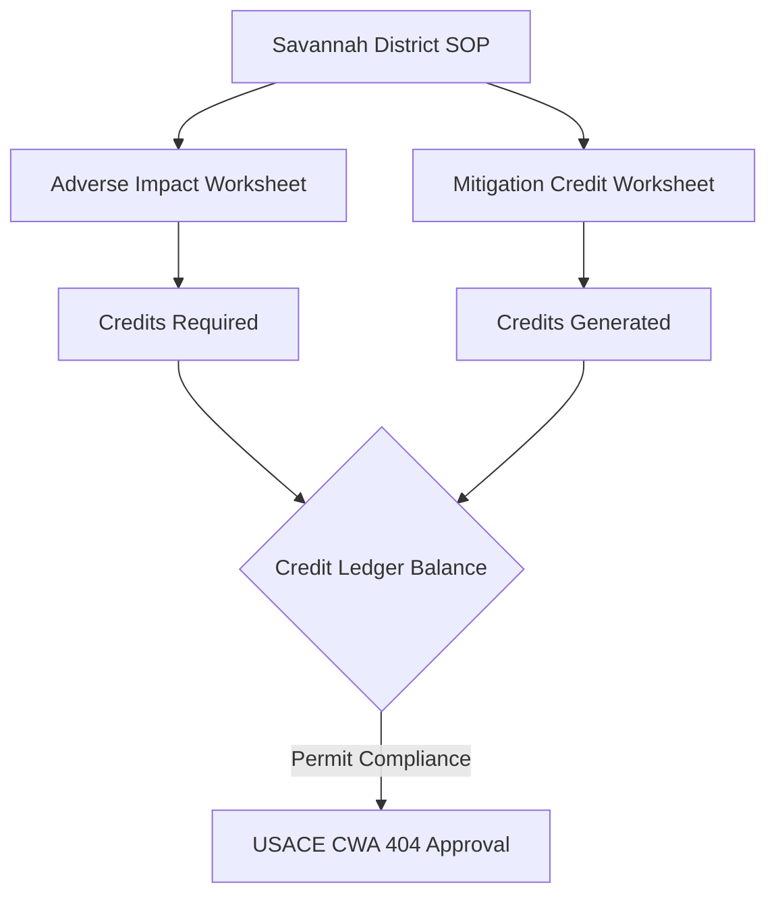
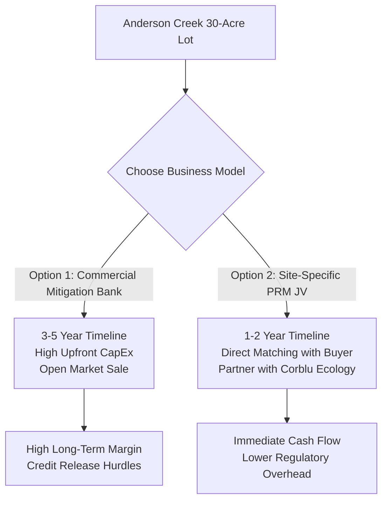
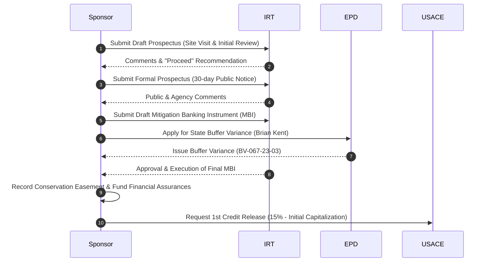
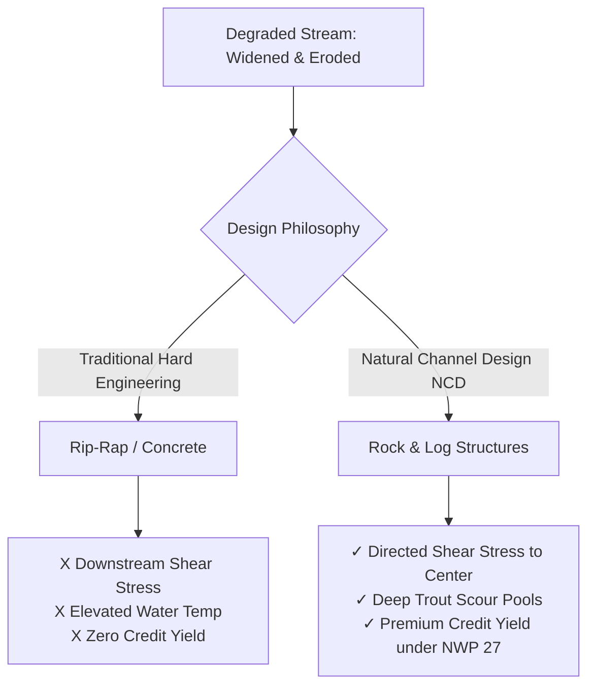

# USACE Savannah District Mitigation Banking & Stream Restoration Framework
*A Technical and Regulatory Guide for Stream Mitigation Credit Development in Georgia*

This framework provides a rigorous, technical, and regulatory assessment for establishing a stream mitigation credit business in North Georgia. It is designed to guide Hunter (*Fly Fishing Georgia North Mountains*) through the regulatory mechanics of the U.S. Army Corps of Engineers (USACE) Savannah District, the application of the Savannah District Stream Mitigation Standard Operating Procedure (SOP), and the technical execution of Natural Channel Design (NCD) to restore degraded trout waters.

---

## 1. Savannah District Stream Mitigation SOP & Credit Calculations

The Savannah District of the USACE governs stream and wetland mitigation in Georgia. The district utilizes a highly structured, factor-based **Stream Mitigation Standard Operating Procedure (SOP)** to quantify both the adverse environmental impacts of development projects and the ecological lift generated by mitigation projects.



### The Credit Calculus: Impact vs. Mitigation

Under CWA Section 404, developers must offset unavoidable stream impacts by purchasing mitigation credits. The SOP uses two primary worksheets to balance the ledger:
1. **Adverse Environmental Impact Worksheet**: Calculates the credits a developer must purchase to offset project impacts.
2. **Stream Mitigation Credit Worksheet**: Calculates the credits a mitigation bank or a Permittee-Responsible Mitigation (PRM) project generates through restoration.

#### Adverse Environmental Impact Formula
The credits required to offset an impact are calculated as:
$$\text{Credits Required} = \text{Impact Length (Linear Feet)} \times \sum (\text{Impact Factors})$$

The Impact Factors include:
*   **Stream Flow Type**: Ephemeral (0.1), Intermittent (0.4), Perennial (0.9)
*   **Priority Area**: Primary (0.4), Secondary (0.1), Tertiary (0.0) (based on watershed sensitivity and biological importance)
*   **Impact Type**: Piping (2.0), Channelization/Relocation (1.5), Fill (1.0), Dredging/Impoundment (0.8), Utility Crossing (0.2)
*   **Duration**: Permanent (1.5), Temporary (0.1)
*   **Existing Stream Status**: Unimpacted (0.5), Moderately Degraded (0.2), Severely Degraded (0.1)

> [!NOTE]  
> For an industrial developer like **Taylor Mathis** (represented by **Mike Irby**) developing the **Longacre Logistics Center** under **USACE Individual Permit SAS-2022-00219**, routing a perennial stream through a culvert (piping) represents a permanent, high-factor impact. A 1,000-linear-foot pipe in a Primary Priority Area on an unimpacted perennial stream would require:
> $$\text{Credits Required} = 1,000 \times (0.9 \text{ [Perennial]} + 0.4 \text{ [Primary]} + 2.0 \text{ [Piping]} + 1.5 \text{ [Permanent]} + 0.5 \text{ [Unimpacted]}) = 5,300 \text{ Credits}$$

#### Stream Mitigation Credit Formula
The credits generated by a restoration project are calculated as:
$$\text{Credits Generated} = \text{Mitigation Length (Linear Feet)} \times \sum (\text{Mitigation Factors})$$

The Mitigation Factors are additive and reflect the degree of ecological uplift:
$$\sum (\text{Mitigation Factors}) = M_{\text{benefit}} + M_{\text{buffer}} + M_{\text{monitoring}} + M_{\text{protection}} + M_{\text{flow}} + M_{\text{watershed}}$$

| Mitigation Factor | Category / Parameter | SOP Value Range | Technical Rationale & Trout Stream Applications |
| :--- | :--- | :--- | :--- |
| **Net Benefit ($M_{\text{benefit}}$)** | **Stream Channel Restoration (Priority 1/2)**<br>Stream Channel Enhancement<br>Bank Stabilization | **2.0 – 4.0**<br>1.0 – 2.0<br>0.5 – 1.0 | **Rosgen Priority 1/2 Restoration** (reconnecting stream to historic floodplain) yields the maximum factor of **4.0** due to complete geomorphic and hydrological restoration. |
| **Riparian Buffer ($M_{\text{buffer}}$)** | **Restoration (Planting Native Canopy)**<br>Enhancement (Invasive Removal)<br>Preservation | **0.8 – 1.5**<br>0.4 – 0.8<br>0.1 – 0.3 | Values are calculated per bank and scaled based on width. In North Georgia trout waters, a **100-foot buffer** is the biological gold standard to maintain cool water temperatures and filter sediment. |
| **Monitoring ($M_{\text{monitoring}}$)** | **7-Year Monitoring Period**<br>5-Year Monitoring Period | **0.4**<br>0.2 | Trout streams (coldwater habitats) require a **7-year monitoring period** under Savannah District guidelines to prove stable geomorphic adjustments and biological recovery. |
| **Site Protection ($M_{\text{protection}}$)** | **Conservation Easement (CE)**<br>Restrictive Covenant<br>Deed Restriction | **0.8 – 1.0**<br>0.4 – 0.6<br>0.1 – 0.2 | A perpetual Conservation Easement held by an accredited third-party land trust (e.g., Georgia Land Trust) yields the maximum factor (**1.0**). |
| **Stream Flow ($M_{\text{flow}}$)** | Perennial Stream<br>Intermittent Stream | **0.4**<br>0.2 | Perennial flow guarantees year-round ecological yield, justifying a higher baseline multiplier. |
| **Watershed Priority ($M_{\text{watershed}}$)** | Primary Priority Area<br>Secondary Priority Area<br>Tertiary Priority Area | **0.4**<br>0.2<br>0.1 | Primary Priority Areas represent biologically sensitive basins, such as key trout watersheds in the Upper Chattahoochee or Coosawattee river basins. |

---

## 2. Commercial Models: Mitigation Banking vs. Permittee-Responsible Mitigation (PRM)

For Hunter’s first project at **Anderson Creek** (a 30-acre lot in Fannin/Gilmer County featuring a perennial trout stream that has been historically widened, cleared, and severely eroded), choosing the correct business model is critical to managing capital, timelines, and regulatory risk.



### Detailed Business Model Comparison

| Parameter | Commercial Mitigation Bank | Permittee-Responsible Mitigation (PRM) |
| :--- | :--- | :--- |
| **Definition** | A commercial bank sponsor establishes a large-scale mitigation site, generates credits, and sells them to various regional buyers via the USACE RIBITS registry. | A single-user mitigation site designed specifically to offset the permitted impacts of one developer's project (e.g., Taylor Mathis). |
| **Timeline** | **36 to 60 months** from pre-planning to final instrument execution and initial credit release. | **12 to 24 months**, run in parallel with the developer's CWA 404 permit application. |
| **Upfront Cost (CapEx)** | **High ($250,000 – $500,000+)** in engineering, geomorphic modeling, baseline monitoring, legal fees for MBI drafting, and financial assurance funding. | **Low to Moderate ($100,000 – $150,000)**, typically funded or heavily subsidized by the credit buyer under an escrow agreement. |
| **Risk Profile** | **High**: Subject to the veto of the Interagency Review Team (IRT), shifting market credit prices, and long-term biological performance liabilities. | **Low**: A buyer is secured upfront. The project is approved as part of the buyer's Individual Permit (IP), eliminating market risk. |
| **Credit Pricing & Margin** | **Premium pricing** ($120 – $220/LF for stream credits, rising to **$200 – $280/LF for coldwater trout stream credits** in North Georgia due to extreme scarcity). | Solid margins, but capped by the negotiated contract price with the specific developer. Often structured as a turn-key project fee. |
| **Financial Assurances** | Requires high-value Letters of Credit (LOC) or escrow accounts to guarantee construction and monitoring performance. | Standard construction performance bonds are typically sufficient; liability is often shared with the permittee. |

### Strategic Recommendation for Anderson Creek

For the 30-acre Anderson Creek site, **a Permittee-Responsible Mitigation (PRM) Joint Venture (JV)** is highly recommended as Hunter's entry point into the mitigation industry.

#### The "PRM Joint Venture" Strategy
1. **The Landowner & Operator (Hunter)**: Provides the 30-acre land asset containing 1,500 linear feet of degraded perennial trout stream. Hunter executes the physical in-stream restoration using natural channel design (rock vanes, root wads) and manages the riparian replanting.
2. **The Joint Venture Partner (Corblu Ecology Group)**: Leverage the expertise of a premium mitigation firm like **Corblu Ecology Group, LLC** (led by **Neil Blackman**, `nblackman@corblu.com`). Corblu provides the standard engineering templates, handles the complex geomorphic modeling, navigates the Savannah District IRT, and acts as the broker.
3. **The Anchor Buyer (Taylor Mathis)**: Direct-match the credit yield of Anderson Creek to **Taylor Mathis** (contact **Mike Irby**, `mirby@taylormathis.com`) to satisfy their mitigation requirements for the **Longacre Logistics Center** under **USACE Individual Permit SAS-2022-00219**.

#### Financial Projection: Anderson Creek (1,500 Linear Feet)
*   **Ecological Lift (SOP Credit Factor)**: Through Priority 1 Rosgen restoration, 100-foot native buffers, and a 7-year monitoring commitment, the project can generate an average of **6.2 credits per linear foot**.
*   **Total Credit Yield**: 
    $$1,500\text{ LF} \times 6.2\text{ credits/LF} = 9,300\text{ Credits}$$
*   **Gross Market Value**: At a conservative coldwater stream credit price of **$180/credit**:
    $$9,300\text{ credits} \times \$180 = \$1,674,000$$
*   **Timeline to Cash Flow**: Under a PRM model matched to Taylor Mathis, Hunter can secure a significant upfront mobilization payment from the developer to cover engineering and construction costs, eliminating the traditional 3-year pre-revenue bank timeline.

---

## 3. Georgia Regulatory Approval Steps & Credit Release Schedules

Establishing a mitigation asset in Georgia requires navigating a rigorous dual-track federal and state permitting process. This involves the USACE Savannah District for federal Clean Water Act compliance and the Georgia DNR Environmental Protection Division (EPD) for state-level erosion control and buffer protection.



### The Georgia Interagency Review Team (IRT)
The IRT evaluates all mitigation banks and major PRM projects in Georgia. It is chaired by the **USACE Savannah District** and includes:
*   **U.S. Environmental Protection Agency (EPA) Region 4** (focuses on Clean Water Act Section 404(b)(1) guidelines)
*   **U.S. Fish and Wildlife Service (USFWS)** (focuses on Endangered Species Act compliance, e.g., protection of the endemic Etowah Darter or Indiana Bat in North Georgia)
*   **Georgia DNR Environmental Protection Division (EPD)** (governs water quality standards, overseen by representatives like **Brian Kent** at `brian.kent@dnr.ga.gov` within the Erosion and Sedimentation Unit)
*   **Georgia DNR Wildlife Resources Division (WRD)** (focuses on coldwater trout stream regulations, thermal cover, and biological integrity)

### Step-by-Step Approval Pathway

#### Step 1: Draft Prospectus & Site Visit
*   **Action**: The sponsor (Hunter/Corblu) submits a conceptual plan detailing baseline degraded conditions, historical land use, and proposed restoration techniques.
*   **Milestone**: The IRT conducts a physical site visit to inspect the geomorphic degradation of Anderson Creek. The IRT provides initial feedback on whether the site is suitable for credit generation.

#### Step 2: Formal Prospectus & Public Notice
*   **Action**: Submittal of a comprehensive Prospectus detailing watershed hydrology, regional sediment dynamics, target geomorphic parameters, and a draft restoration design.
*   **Milestone**: USACE issues a **30-day Public Notice** to solicit comments from stakeholders, including environmental NGOs like the **Chattahoochee Riverkeepers**. The sponsor must address all public and agency comments.

#### Step 3: Draft & Final Mitigation Banking Instrument (MBI)
*   **Action**: Submission of the MBI—the legally binding contract between the sponsor and the federal government. The MBI includes detailed engineering blueprints, hydraulic modeling (HEC-RAS), native planting lists, geomorphic performance standards, monitoring protocols, and a legal description of the property.
*   **Milestone**: The sponsor applies for a **Georgia EPD Buffer Variance (e.g., similar to BV-067-23-03)** through **Brian Kent** at EPD, which is required because constructing NCD structures involves temporary, minor land disturbance within the state-protected 50-foot trout stream buffer.

#### Step 4: Execution, Conservation Easement, and Financial Assurances
*   **Action**: Once approved, the sponsor executes the final MBI, records a perpetual **Conservation Easement (CE)** in county land records to legally protect the 30-acre tract, and establishes **Financial Assurances** (typically an irrevocable Letter of Credit or a cash escrow account covering 110% of construction and 7 years of monitoring costs).

### Standard Savannah District Credit Release Schedule
Mitigation credits are released in phases based on construction and ecological performance milestones. A typical 7-year trout stream credit release schedule in the Savannah District is structured as follows:

```
[MBI Execution & CE Recorded] ──► 15% Release (Initial Capitalization)
               │
      [As-Built Approval]     ──► 25% Release (Construction Complete)
               │
    [Year 1 Performance Met]  ──► 10% Release
               │
    [Year 2 Performance Met]  ──► 10% Release
               │
    [Year 3 Performance Met]  ──► 10% Release (Mid-Term Geomorphic Success)
               │
    [Year 4 Performance Met]  ──► 10% Release
               │
    [Year 5 Performance Met]  ──► 10% Release
               │
    [Year 7 Performance Met]  ──► 10% Release (Final Closeout & Long-Term Stability)
```

1.  **Initial Release (15%)**: Released immediately upon execution of the MBI, recording of the Conservation Easement, and securing the Financial Assurances. This provides critical upfront capital.
2.  **Construction Release (25%)**: Released upon successful completion of all earthwork, installation of rock/log structures, riparian planting, and IRT approval of the physical "As-Built" geomorphic survey.
3.  **Year 1 Monitoring Release (10%)**: Released upon approval of the Year 1 monitoring report, demonstrating survival of at least 80% of planted native vegetation and geomorphic stability after bankfull flow events.
4.  **Years 2 through 5 Monitoring Releases (10% annually)**: Released incrementally if geomorphic structures remain stable, sediment deposition is controlled, invasive species are kept under 5% coverage, and water temperature data demonstrates coldwater trout habitat preservation.
5.  **Year 7 Final Release (10%)**: Released upon final closeout, proving the stream has successfully transitioned to a self-sustaining, stable equilibrium state without active management.

---

## 4. Bioengineering, Natural Channel Design (NCD) & Trout Habitat Validation

From a regulatory and ecological perspective, traditional "hard engineering" (e.g., concrete channels, heavy rip-rap) is heavily discouraged and highly unlikely to receive IRT approval or generate mitigation credits under the Savannah District SOP. Conversely, **Rosgen Natural Channel Design (NCD)** and bioengineering techniques are strongly supported, as they restore the natural physical processes of the stream while creating high-value coldwater trout habitat.



### Rosgen Priority Levels of Restoration
The Rosgen methodology classifies stream restoration into four distinct priority levels, ranked by their geomorphic and ecological effectiveness:

1.  **Priority 1: Reconnecting to the Historic Floodplain (Recommended)**
    *   *Technical Execution*: Raising the stream bed elevation or excavating a new channel at its original historic floodplain elevation.
    *   *Ecological Benefit*: When high flows occur, water immediately spills out onto the floodplain, dissipating energy and eliminating bank shear stress. This is the gold standard for trout streams, as it restores groundwater tables and wetlands, ensuring cold baseflows in summer.
2.  **Priority 2: Creating a New Floodplain at a Lower Elevation**
    *   *Technical Execution*: Excavating a new, stable bankfull channel and an adjacent active floodplain bench within the existing incised channel.
    *   *Ecological Benefit*: Used when the stream bed cannot be raised. Dissipates energy and establishes stable channel dimensions.
3.  **Priority 3: Re-profiling the Stream in Place**
    *   *Technical Execution*: Modifying the stream's slope and cross-section without creating a wide floodplain.
    *   *Ecological Benefit*: Relies heavily on structural bank stabilization. It is less preferred because it does not fully restore natural flood dynamics.
4.  **Priority 4: Hardening Banks in Place (Not Approved for Mitigation)**
    *   *Technical Execution*: Armor plating banks with rip-rap or concrete walls.
    *   *Result*: Fails to generate mitigation credits; transfers destructive kinetic energy downstream, worsening regional erosion.

---

### Technical Breakdown of NCD Structures & Trout Habitat Synergy

Hunter’s proposed use of rock and log structures is highly validated by both hydraulic science and USACE regulatory standards. These structures are permitted under **Nationwide Permit 27 (NWP 27)**, which specifically facilitates aquatic habitat restoration.

#### 1. J-Hook Vanes (Rock or Log)
*   **Geomorphic Function**: A J-hook is an upstream-pointing rock vane that extends from the bank into the channel, curving into a "J" shape at the center. The structure is angled at 20–30 degrees relative to the bank. It directs high-velocity vectors *away* from the vulnerable outer bank and toward the center of the channel.
*   **Trout Habitat Synergy**: The "hook" portion at the center creates a controlled, high-velocity plunge that scours out a deep pool. This scour pool provides vital coldwater refuge and thermal cover for trout. The turbulent surface of the pool provides "bubble cover," hiding trout from avian predators, while the upstream portion of the vane creates a low-velocity rest zone.

```
                  Outer Bank (Stabilized with Bioengineering)
              ═════════════════════════════════════════════
                            \
                             \  Vane Slope (Spillway)
                              \
                 Flow Direction \   Deep Scour Pool
                       ──►       ( ) (Trout Cover)
                                 /
                                /  Hook (Rock Sill)
                               /
              ═════════════════════════════════════════════
                              Inner Bank
```

#### 2. Cross-Vanes
*   **Geomorphic Function**: A double-sided rock structure spanning the entire channel, sloping downward from the banks to a low-center throat. It acts as a grade-control structure, preventing channel incision (headcutting) and stabilizing the stream bed profile.
*   **Trout Habitat Synergy**: Concentrates flow over the center of the structure, creating a massive plunge pool downstream. This pool serves as an ideal holding area for large trout. The step-pool sequence aerates the water, significantly increasing dissolved oxygen levels, which is crucial for coldwater species during warm Georgia summers.

#### 3. Root Wads & Log Vanes
*   **Geomorphic Function**: A bioengineering technique where a tree trunk (10–15 feet long) with the root ball intact is placed horizontally into the bank. The root ball faces upstream into the flow, and the trunk is anchored back into the bank with heavy boulders and native soil.
*   **Trout Habitat Synergy**: The root mass acts as a natural energy dissipator, absorbing the kinetic energy of the water and trapping organic debris. The spaces between the roots create complex micro-habitats, providing outstanding physical cover for juvenile trout and generating excellent substrate for aquatic macroinvertebrates (mayflies, stoneflies, caddisflies), which are the primary food source for trout.

#### 4. Native Riparian Buffer Restoration (100-Foot Standard)
*   **Geomorphic Function**: The root systems of native woody vegetation (e.g., Sycamore, River Birch, Alnus serrulata) bind bank soils, providing long-term cohesion and resistance to shear stress.
*   **Trout Habitat Synergy**: Crucial for coldwater streams. The dense canopy provides shade, preventing solar radiation from heating the water. It contributes leaf litter, which drives the aquatic food web, and provides large woody debris (LWD) over time, creating natural habitat complexity.

---

### Regulatory Contrast: Natural Channel Design vs. Hard Engineering

| Parameter | Natural Channel Design (NCD) | Traditional Hard Engineering |
| :--- | :--- | :--- |
| **Primary Materials** | Native stone, large woody debris, root wads, live willow stakes, and native vegetation. | Quarried angular rip-rap, steel sheet piling, gabion baskets, and poured concrete. |
| **Hydraulic Strategy** | **Dissipates energy** by increasing channel roughness and directing high velocities to the center of the channel. | **Resists energy** with rigid structures, accelerating velocities and transferring shear stress downstream. |
| **Regulatory Standing** | Highly favored by the IRT under **NWP 27**. Receives maximum credits under the Savannah District Stream SOP. | Viewed unfavorably; often requires a complex **Individual Permit (IP)**. Receives **zero** mitigation credits. |
| **Ecological Impact** | Restores the hyporheic zone, increases dissolved oxygen, creates micro-habitats, and provides thermal cover for trout. | Destroys the stream bed interface, elevates water temperatures (due to thermal absorption of rock/concrete), and blocks fish passage. |
| **Response to NGO Scrutiny** | Actively praised by watchdogs like **Chattahoochee Riverkeepers** due to ecological lift and water quality improvements. | Subject to heavy opposition, public comments, and potential legal challenges under the Clean Water Act. |

---

## 5. Summary Action Plan for Hunter’s Stream Restoration Business

To commercialize this framework and execute the Anderson Creek project, Hunter should follow a phased operational plan:

```mermaid
grid
    layout: 1
    
    title: Phase 1: Strategic Alignment & Site Diligence (Months 1-3)
    - Form a Joint Venture (JV) with **Corblu Ecology Group** to leverage Neil Blackman's regulatory relationships and engineering infrastructure.
    - Initiate conversations with **Mike Irby** at **Taylor Mathis** to position the 1,500-LF Anderson Creek restoration as the site-specific PRM solution for their **Longacre Logistics Center** permit requirements.
    - Conduct a detailed geomorphic and biological baseline survey of Anderson Creek (measuring cross-sections, bankfull width/depth, sediment distribution, and trout density).

    title: Phase 2: Permitting & Design (Months 4-9)
    - Complete the hydraulic and NCD design (featuring J-hooks, cross-vanes, and root wads) and submit the PRM restoration plan to the USACE Savannah District.
    - Apply for a state **Georgia EPD Buffer Variance** through **Brian Kent** to permit temporary construction within the 50-foot trout buffer.
    - Engage in proactive outreach with the **Chattahoochee Riverkeepers** to secure their support, highlighting the use of bioengineering and native plantings over hard armoring.

    title: Phase 3: Construction & Capitalization (Months 10-15)
    - Record the perpetual **Conservation Easement (CE)** on the 30 acres and establish the required Financial Assurances.
    - Secure the initial **15% credit release** (or equivalent milestone payment from Taylor Mathis) to mobilize construction equipment.
    - Execute the physical restoration, starting with in-stream earthwork during low-flow periods, followed immediately by bank bioengineering and riparian planting.

    title: Phase 4: Long-Term Monitoring & Yield Realization (Years 2-7)
    - Execute the 7-year monitoring plan, submitting annual reports to the IRT detailing channel stability, native vegetation survival, and thermal profiles.
    - Draw down the incremental **10% annual credit releases** as geomorphic and biological performance standards are met.
```
