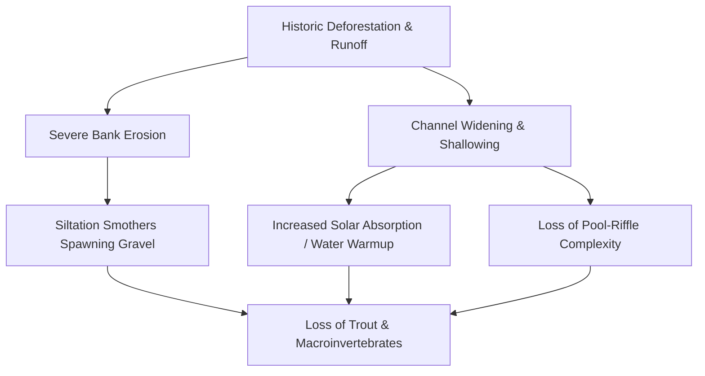

# Project Profile: Anderson Creek (ACR) Stream Restoration
## Showcase Case Study & Permittee-Responsible Mitigation (PRM) Blueprint

**Location**: 30-Acre Lot, Anderson Creek, Gilmer/Fannin County, North Georgia  
**Target Basin**: Coosa River Basin (Sub-basin: Upper Coosa / Ellijay River)  
**Project Sponsor**: Granite Holdings / Hunter's Save Our Streams Inc.  

---

## 1. Project Vision & Objectives

Anderson Creek represents the **flagship showcase project** for Hunter's new venture. By restoring a degraded stream on this 30-acre lot, the project will achieve a dual-mandate:
1.  **Ecological & Recreational Optimization**: Transform a widened, eroding, and thermally degraded channel into a world-class, self-sustaining mountain trout fishery (Brook, Rainbow, and Brown trout).
2.  **Mitigation Credit Proof-of-Concept**: Establish a high-yielding **Permittee-Responsible Mitigation (PRM)** project under USACE Nationwide Permit 27 (NWP 27) to generate stream mitigation credits, creating a repeatable case study to sell stream restoration services to corporate developers throughout the Southeast.

---

## 2. Pre-Restoration Baseline (The Problem)

Like many streams in North Georgia impacted by historic logging and agricultural clearing, the section of Anderson Creek traversing the 30-acre lot exhibits significant channel instability:

*   **Excessive Channel Widening (Overwidening)**: The stream has lost its original "footings" (proper bankfull width-to-depth ratio). It is overly wide, shallow, and sluggish during summer low-flows.
*   **Severe Bank Erosion**: Lack of deep-rooted riparian vegetation has caused the sandy-clay banks to collapse during high-water events. Siltation has smothered the downstream cobble, burying critical trout spawning gravel and macroinvertebrate (trout food) habitat.
*   **Thermal Loading**: The wide, shallow water surface absorbs excessive solar radiation. Temperatures rise above $68^\circ\text{F}$ in July and August—the critical stress threshold for trout.
*   **Habitat Homogenization**: The channel lacks "pool-riffle" diversity. There are no deep holding pools, pocket water, or overhead woody cover to protect adult trout from predators and high shear stress.



---

## 3. Post-Restoration Design & Hunter's Bioengineering Techniques

Instead of using traditional "hard engineering" (e.g., rip-rap boulders, concrete retaining walls) which worsens downstream erosion and destroys habitat, Hunter will implement **Natural Channel Design (NCD)** (Rosgen Level II/III stream restoration). 

Hunter's signature method uses **native logs, root wads, and strategically placed river stones** to restore the stream to its original, stable bankfull cross-section:

### Instream Restructuring Techniques
*   **Log Vanes & Log J-Hooks**: Native hemlock or oak logs are angled upstream into the bank. They redirect the velocity vectors of high flows *away* from the fragile banks and force them into the center of the channel. The downstream plunge scours out deep holding pools while stabilizing the bank naturally.
*   **Rock Cross-Vanes & Banded Boulders**: Strategic rock structures spanning the channel width. These structures lock in the grade (preventing bed degradation), narrow the bankfull channel, and create a localized riffle-pool drop sequence. The tumbling water highly oxygenates the stream, creating essential summer refuge.
*   **Root Wad Complexes**: Salvaged tree roots are embedded directly into the eroding bank curves. The root mass breaks up water velocity, traps sediment to rebuild the bank, and provides immediate, premium refuge cover for trophy trout.
*   **Cobble & Gravel Seeding**: Restoring clean, sorted river gravel (1/2" to 2" diameter) in the riffle zones to re-establish trout spawning beds.

### Riparian Buffer Restoration
*   **Soil Bioengineering (Live Stakes)**: Inserting dormant black willow, silky dogwood, and elderberry stakes directly into the bank. They take root rapidly, locking the soil matrix in place.
*   **Native Canopy Re-Establishment**: Planting **Eastern Hemlock, River Birch, and Tulip Poplar** along the 50-foot stream buffer. As they grow, they provide dense shade to cool the stream (thermal mitigation) and drop leaf litter that feeds the aquatic food web.

---

## 4. Mitigation Credit Generation & Georgia SOP Analysis

Under the **USACE Savannah District Stream Mitigation SOP**, Hunter's restoration work at Anderson Creek is highly valuable. Stream credits are generated based on three primary factors:

### Credit Generation Formula (Savannah District SOP)
$$\text{Credits Generated} = \text{Stream Length (ft)} \times \left( M_{\text{Instream}} + M_{\text{Riparian}} + M_{\text{Monitoring}} \right) \times M_{\text{Stream Order}}$$

*   **Instream Physical Structure Credit ($M_{\text{Instream}}$)**: Restoring the channel's natural cross-section, pools, and spawning riffles using logs/rocks yields the maximum **"Priority 1 Restoration"** multiplier ($\sim 1.0 - 1.2$ credits per linear foot).
*   **Riparian Buffer Credit ($M_{\text{Riparian}}$)**: Planting native woody vegetation in a 50-foot or 100-foot buffer on both sides yields an additional $\sim 0.4 - 0.6$ credits per linear foot.
*   **Baseline & Monitoring Multiplier ($M_{\text{Monitoring}}$)**: Committing to a 5-to-7-year ecological monitoring program guarantees maximum credit release.

### Project Yield Estimate (Anderson Creek)
*   **Estimated Restored Reach**: 2,500 linear feet of stream channel.
*   **Average Credit Yield**: $1.8$ credits per linear foot (High-Priority Instream NCD + 100-foot Riparian Buffer).
*   **Total Credit Yield**: **4,500 Stream Mitigation Credits**.
*   **Market Value**: In the Upper Coosa Basin, stream credits currently trade between **$90 and $115 per credit**.
*   **Gross Asset Value**: **$405,000 to $517,500** in mitigation credit assets!

---

## 5. Implementation & Capital Flow Strategy

To maximize cash flow and establish Hunter's track record, we recommend the following step-by-step rollout:

```
[Phase 1: Permitting] ──> [Phase 2: Joint Venture] ──> [Phase 3: Construction] ──> [Phase 4: Sales]
  - Submit CWA NWP 27        - Partner with Neil          - Execute "Rocks & Logs"       - Broker credits to
  - Establish baseline        - Corblu acts as Sponsor     - Rebuild original footings   - target developers
```

1.  **Phase 1: Baseline Survey & Permitting (Months 1–4)**:
    *   Perform longitudinal surveys and cross-sectional channel profiles.
    *   File for a **USACE Nationwide Permit 27 (NWP 27)** for Aquatic Habitat Restoration.
    *   File for a **Georgia EPD Stream Buffer Variance (SBV)** for temporary buffer disturbance during construction.
2.  **Phase 2: Neil Blackman / Corblu JV (Months 5–6)**:
    *   Since establishing a standalone commercial bank has a high regulatory barrier, Hunter should enter a **Joint Venture (JV)** with **Neil Blackman at Corblu Ecology Group**.
    *   Corblu acts as the "Bank Sponsor" (managing the regulatory filings and financial assurances), while Hunter's company acts as the "Design-Build Contractor".
    *   This secures instant credibility with the Interagency Review Team (IRT).
3.  **Phase 3: NCD Construction (Months 7–9)**:
    *   Hunter executes the instream work using local log/rock sourcing.
    *   Complete the riparian buffer planting.
    *   Host a VIP "Showcase Day" inviting regional brokers, land trusts, and developers (including **Mike Irby at Taylor Mathis**) to view the active restoration.
4.  **Phase 4: Credit Release & Sales (Months 10+)**:
    *   Secure the initial **15% credit release** from the USACE Savannah District upon completion of construction.
    *   Utilize Corblu's broker network to sell the initial batch of credits ($\sim 675$ credits) to active commercial/logistics developments in the Coosa service area, generating **$\sim$ $67,500 in early non-dilutive cash flow** to fund subsequent monitoring and business expansion.
