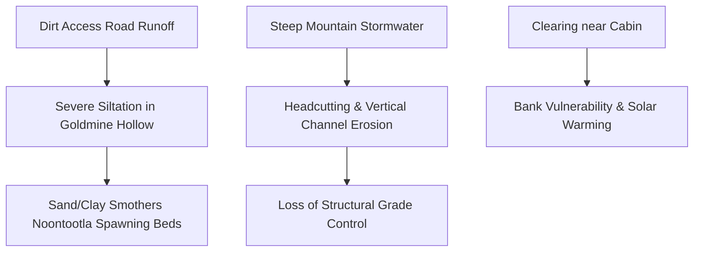

# Project Profile: Goldmine Hollow at Hunter's Cabin
## Case Study B: Wild Trout Tributary Restoration & Private Landowner Showcase

**Location**: Hunter's Cabin, Goldmine Hollow (tributary to Noontootla Creek), Fannin County, North Georgia  
**Receiving Stream**: **Noontootla Creek** (State-Designated Wild Trout Stream)  
**Project Sponsor**: Save Our Streams Inc.  

---

## 1. Project Vision & Objectives

Noontootla Creek is legendary—widely recognized as one of the premier, highly protected wild trout streams in the Southeast, boasting self-sustaining populations of stream-born Rainbow and Brown trout. **Goldmine Hollow** is a critical coldwater tributary that feeds directly into Noontootla Creek at **Hunter's Cabin** (near Newport Road and Noontootla Ridge Court).

This project serves as Hunter's **Premium Private Landowner Showcase**:
1.  **Sediment & Siltation Control**: Stop sediment runoff from Goldmine Hollow’s steep slopes and access roads (like Peter Knob Road) from entering Noontootla Creek, protecting critical downstream wild trout spawning beds.
2.  **Tributary Step-Pool Restoration**: Reconstruct the steep geomorphic step-pools of the hollow's stream using native wood and stone, creating a sanctuary for juvenile wild brook and rainbow trout.
3.  **High-End Marketing Asset**: Use Hunter's own cabin and restored stream as a "living showroom" to pitch high-end design-build services to wealthy private landowners who own estates along premium trout waters like the Toccoa, Cartecay, and Soque rivers.

---

## 2. Pre-Restoration Baseline (The Problem)

Goldmine Hollow, while pristine in its thermal regime (highly shaded and cold), suffers from physical geomorphic degradation:

*   **Sediment Loading (Siltation)**: Severe erosion from unpaved mountain access roads (such as Peter Knob Road and Newport Road) washes highly abrasive sandy-clay sediment into the hollow during heavy rains. This sediment settles at the confluence, smothering the clean cobble and gravel beds of Noontootla Creek.
*   **Debris Scouring & Headcutting**: High-velocity stormwater flows down the steep hollow have scoured out the natural plunge-pools, causing a "headcut" (vertical channel erosion) that threatens the stability of the cabin's stream crossings.
*   **Buffer Degradation**: Historic clearing close to the cabin has removed hemlocks and rhododendrons, exposing portions of the small creek to sunlight and increasing bank vulnerability.



---

## 3. Post-Restoration Design & Hunter's Bioengineering Solutions

Because this is a steep mountain tributary ("A" or "B" type channel under the Rosgen geomorphic classification), the restoration must focus on **energy dissipation, grade stabilization, and sediment trapping**:

### Instream Restructuring Techniques
*   **Native Log Step-Pools**: Hunter will construct a series of step-pools using local cedar or oak logs anchored deeply into both banks. These logs create small, stable vertical drops (6" to 12" steps) that dissipate the energy of mountain torrents, trapping sediment behind the logs while scouring deep, stable plunge pools downstream.
*   **Banded Stone Sills**: Semicircular rock arches pointing upstream. These stones lock the channel bed in place, preventing the headcut from migrating upstream toward the cabin foundation.
*   **Confluence Sediment Trap**: Build a natural, biological sediment basin just upstream of the Noontootla Creek confluence. Utilizing native river stones and thick root mats, this trap filters out road sand during storm events, allowing only clean, cold water to enter Noontootla Creek.

### Riparian Buffer & Aesthetic Enhancement
*   **Hemlock & Rhododendron Re-Establishment**: Plant native Eastern Hemlocks and dense Rosebay Rhododendrons along the stream bank near Hunter's Cabin. These plants establish a dense root matrix that binds the steep soils and provides the thick, year-round shade that is essential for coldwater trout.
*   **Lunker Structures / Overhead Cover**: Build specialized underwater wooden platforms (Lunker structures) in the deeper plunge pools. These provide premium hiding cover for large wild trout migrating up from Noontootla Creek during high water.

---

## 4. Business & Marketing Strategy: The "Living Showroom"

While the Anderson Creek (ACR) project focuses on high-volume commercial USACE credit banking, Goldmine Hollow at Hunter's Cabin is the **heart of Hunter's high-end private client marketing strategy**:

```
                  PRIVATE LANDOWNER SALES PIPELINE
                  
  [ 1. THE VISIT ] ──────────────────> [ 2. THE EXPERIENCE ]
    Invite premium landowners            Fly fish the legendary wild
    & land brokers to the Cabin          trout of Noontootla Creek
    
                                                 │
                                                 ▼
                                                 
  [ 4. THE SALE ] <─────────────────── [ 3. THE SHOWROOM ]
    Close high-margin design-build       Walk Goldmine Hollow to show
    contracts for their estates          NCD step-pools & bioengineering
```

1.  **The "Cabin Weekend" Experience**:
    *   Hunter invites wealthy private landowners, fly-fishing club members, and premium land brokers to spend a weekend at his cabin.
    *   Guests fly-fish the legendary waters of Noontootla Creek, experiencing firsthand the quality of a healthy wild trout fishery.
2.  **The Fluvial Walkthrough**:
    *   Hunter conducts a guided walk along the restored Goldmine Hollow reach, showing exactly how natural logs, root wads, and stones stabilized the channel, cleared the water, and built robust trout holding pools without resorting to ugly concrete or rip-rap.
3.  **The High-Margin Pitch**:
    *   This physical, highly visual showcase makes it incredibly easy to close direct design-build consulting contracts (averaging **$50 to $120+ per linear foot**) with wealthy landowners who want to restore streams on their own private estates.
    *   A single 1,000-foot private estate restoration generates **$50,000 to $100,000 in high-margin cash flow** with minimal regulatory permitting hurdles (permitted rapidly under general state maintenance and NWP 27).
