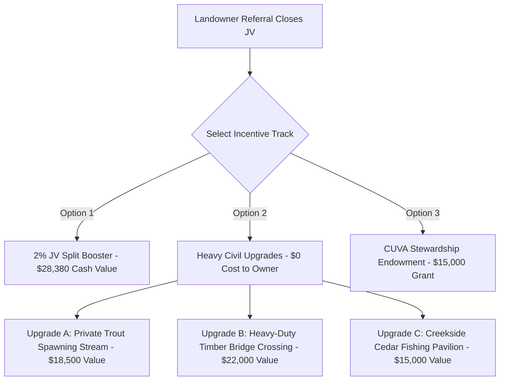

# File 46: Landowner Referral Program & JV Incentive Agreements

> [!IMPORTANT]
> **Strict B2B Launch Policy**: In accordance with executive instructions, **no active outreach or cold emailing will be initiated at this stage**. This playbook, along with the detailed landowner referral incentive structures, neighbor-to-neighbor flyer copies, and the legally robust Georgia UETA-compliant Joint Venture Referral Agreement, is fully staged and ready for immediate campaign activation.

## I. Landowner Loyalty & Peer-to-Peer Referral Program Bylaws

Rural landowners represent the ultimate partners for expanding Save Our Streams Inc.'s geomorphic restoration footprint across North Georgia. Unlike corporate developers, landowners are heavily driven by the long-term stewardship, civil stability, and recreational value of their family estates. 

To turn existing Joint-Venture (JV) land partners into active brand ambassadors, Blue Ridge operates a structured, three-option **Landowner Loyalty & Peer-to-Peer Referral Program**. For any existing landowner partner who refers a neighboring or regional property owner with a qualified degraded stream reach (subject to geomorphic verification of $\ge 50$ contiguous acres and $\ge 1,000$ linear feet of stream channel), Blue Ridge offers a choice of three premium incentives upon the successful execution of the new project's CWA Section 404 Joint-Venture contract:

### Option 1: The Joint-Venture Split Booster (Gross Revenue Acceleration)
For landowners who prioritize liquid capital and long-term estate cash flow, Blue Ridge offers a permanent boost to their existing stream credit sales split:
- **The Split Modification**: The referring landowner's own Joint-Venture credit split ratio is boosted by **2.0%** (increasing their share from the industry-standard **30.0% to 32.0%** of gross credit revenues on all remaining credit release tranches of their active project).
- **The Financial Projections**: On a standard 1,500 linear foot mountain trout stream restoration project (such as Anderson Creek / Sandra's Cabin) yielding 12,900 stream credits:
  - *Standard 30% Share*: Grosses **425,700 USD** at $110/credit.
  - *Referral Boosted 32% Share*: Grosses **454,080 USD** at $110/credit.
  - *Net Value Added*: Generates an additional **28,380 USD** in liquid payout directly to the referring landowner, paid automatically as credits are released by the USACE Savannah District and sold.

### Option 2: Premium On-Site Civil Upgrades (Blue Ridge Construction Track)
Landowners can choose to exchange their cash split booster for direct, premium land enhancements executed on their own property by Blue Ridge's heavy excavation construction and bioengineering crews. Because Blue Ridge has active heavy equipment (e.g., John Deere 130G excavators, Kubota SVL97 compact track loaders) and native materials already staged on-site, we can execute major civil improvements at **0 USD cost to the landowner**:



- **Upgrade A: Private Trophy Trout Spawning Stream & Fishery Enhancement**
  - *Design & Engineering*: Design and physical excavation of a custom 100-linear-foot secondary coldwater trout spawning channel running parallel to the main restored creek.
  - *Restoration Specifications*: Excavation of a 4-foot-wide meandering gravel run utilizing native sorted pea-to-cobble gravels (designed for Brook and Rainbow trout egg-laying), three instream boulder step-downs, and a small trout resting pool (5-foot depth).
  - *Thermal & Canopy Protection*: Active geomorphic transplanting of mature *Rhododendron maximum* and mountain hemlock along the bank margins to maintain coldwater shading (staying below 65 degrees F).
  - *Commercial Value*: **18,500 USD** (Fully covered under referral program budget).
- **Upgrade B: Heavy-Duty Structural Timber Bridge Crossing**
  - *Design & Engineering*: Engineering, sitework, and structural installation of a heavy-duty timber vehicular bridge crossing over the restored stream channel to connect pasture segments.
  - *Restoration Specifications*: Double-timber abutments backed with bioengineered rock gravity anchors, structural cedar log arches, and a 12-foot-wide heavy timber driving deck rated for a **25-ton vehicular capacity** (accommodating agricultural tractors, timber hauling trucks, and utility vehicles).
  - *Erosion Control*: Bioengineered root-wads and geotextile soil wraps installed at the bridge approaches to prevent high-water shear failures.
  - *Commercial Value*: **22,000 USD** (Fully covered under referral program budget).
- **Upgrade C: Creekside Cedar Fishing Pavilion & Viewing Dock**
  - *Design & Engineering*: Construction of a premium post-and-beam timber-framed red cedar viewing pavilion adjacent to a trophy pool.
  - *Restoration Specifications*: A 12' x 16' open-sided cedar pavilion featuring a tongue-and-groove cedar ceiling, heavy timber structural support posts anchored into concrete footings, rustic timber bench seating, and an integrated 8' x 8' heavy timber viewing dock extending over a restored deep pool.
  - *Commercial Value*: **15,000 USD** (Fully covered under referral program budget).

### Option 3: The CUVA Stewardship Endowment Grant
For landowners whose properties are currently enrolled in Georgia's **Conservation Use Value Assessment (CUVA)** program under O.C.G.A. § 48-5-7.4:
- **The Grant Structure**: Blue Ridge establishes a **15,000 USD Restricted Stewardship Grant** to support the property's ongoing agricultural and forestry conservation efforts.
- **Eligible Stewardship Uses**: Landowners can draw from this grant to pay for:
  - *Property Tax Offsets*: Reimbursing the landowner's annual property taxes for the CUVA-enrolled acreage.
  - *Certified Forestry Management Plan (FMP)*: Hiring a certified forester to write or update a 10-year timber management plan to maintain CUVA eligibility.
  - *Game & Wildlife Habitat Improvements*: Purchasing native warm-season grass seeds, planting wild turkey/deer food plots, or clearing invasive privet and kudzu on the property boundaries.

---

## II. Neighbor-to-Neighbor Landowner Outreach Kit

### 1. The Legacy Landowner Mailer (Direct Mail Template)
*This mailer is designed to be printed on high-quality, textured cream cardstock featuring a professional, hand-signed letter from Hunter Morris and a customized map of Sandra's Cabin or Anderson Creek. It targets adjacent large landowners in mountain trout watersheds.*

```text
================================================================================
                    Save Our Streams Inc.
                    "Restoring Georgia's Mountain Trout Legacies"
================================================================================

Dear Neighbor,

As a fellow steward of North Georgia's pristine mountain lands, you understand 
that a healthy, flowing creek is the heart of a legacy property. However, over 
decades of agricultural clearing, severe storms, and timber harvesting, many of 
our mountain streams are suffering from accelerated bank erosion, losing valuable 
topsoil and choking out our native wild brook trout spawning gravels.

Save Our Streams Inc. specializes in geomorphic design-build restoration. 
We partner with private landowners to restore eroding creeks into stable, vibrant 
trout wades. Through our Joint-Venture model, we cover 100% of the engineering, 
permitting, and heavy excavation costs. In return, we generate lucrative stream 
mitigation credits under the Clean Water Act Section 404, dividing the revenue 
70/30 in your favor. 

Our current landowner partner, [Referring_Landowner_Name], recently completed 
a stunning stream restoration project on their property at [Referring_Property]. 
Their creek has been stabilized, their trophy trout fishery has been enhanced, 
and they are actively receiving credit proceeds. 

Because [Referring_Landowner_Name] believes in our mission, they have referred 
your property to us for a free geomorphic stream assessment. If your property 
qualifies, we would love to partner with you to restore your creek. In honor of 
this neighbor-to-neighbor referral, you will be eligible for a custom on-site 
land upgrade—such as a custom trout spawning channel, a heavy-duty timber vehicular 
bridge crossing, or a creekside cedar pavilion—constructed entirely at our cost.

We invite you to contact us for a friendly, no-obligation "stream walk" with our 
Managing Director, Hunter Morris. Let's walk your banks together and discuss how 
we can protect your family's land for generations to come.

Warm regards,

Hunter Morris                                [Referring_Landowner_Signature]
Managing Director                            Existing Landowner Partner
hunter@blueridgestream.us.kg                 Save Our Streams Inc. Referral Ambassador
================================================================================
```

### 2. Hunter's Verbal Dialogue (Neighbor-to-Neighbor Warm Intro)
*This dialogue serves as a guide for Hunter Morris when introducing the referral program during localized field visits or when introduced at community events.*

> **Hunter**: "Hey [Landowner_Name], I was actually walking the creek boundaries over at [Referring_Landowner_Name]'s place yesterday—we just completed about 1,500 feet of bioengineered stream bank work over there. [Referring_Landowner_Name] was telling me about how much soil you've been losing along your eastern pasture boundary during those heavy spring rains.
>
> What we do is pretty unique. We're geomorphic builders, not just engineers. We use natural materials—root-wads, cedar logs, and river boulders—to rebuild your banks and lock down that soil permanently. The best part is, under our Joint-Venture model, we pay for every single penny of the USACE permitting, design, and heavy equipment construction. Once it's approved, the federal government issues stream mitigation credits, which we sell to infrastructure builders and data centers. We split those credit sales 70/30, which turns a washed-out creek liability into a major revenue generator.
>
> [Referring_Landowner_Name] loved the work so much they wanted me to come over and take a look at your stretch. If we do a project together, we can build a heavy-duty timber vehicular bridge or a custom trout-spawning run on your pasture at zero cost to you, using our equipment while we are already staged in the valley. Let's do a quick stream walk next week—no strings attached—and see what your banks look like."

---

## III. Legal Agreement Template: Landowner Referral & JV Incentive Agreement

*This legally binding agreement is drafted in full compliance with the Georgia Uniform Electronic Transactions Act (O.C.G.A. § 10-12-1 et seq.). It allows an existing landowner to execute a digital agreement with Blue Ridge to secure referral splits or civil upgrades.*

```text
                 LANDOWNER REFERRAL & JOINT VENTURE INCENTIVE AGREEMENT
                 
THIS LANDOWNER REFERRAL & JOINT VENTURE INCENTIVE AGREEMENT (this "Agreement") 
is entered into by and between Save Our Streams Inc., 
a Georgia limited liability company, with its principal office located in Fannin 
County, Georgia ("Developer"), and the undersigned landowner ("Referring Partner").

1. RECITALS
WHEREAS, Developer specializes in geomorphic fluvial stream restoration and the 
creation of compensatory stream mitigation banks under Section 404 of the Clean 
Water Act and Georgia Department of Natural Resources Environmental Protection 
Division ("EPD") regulations; and
WHEREAS, Referring Partner is an active Joint-Venture partner of Developer under 
an existing Mitigation Banking Agreement, or a recognized community ambassador; and
WHEREAS, Referring Partner desires to identify and introduce third-party rural 
landowners in the State of Georgia with degraded stream resources to Developer, 
subject to the terms, incentives, and legal covenants detailed herein.

NOW, THEREFORE, for good and valuable consideration, the receipt and sufficiency 
of which are hereby acknowledged, the Parties agree as follows:

2. REFERRAL CRITERIA AND QUALIFICATION
To qualify for an incentive payout under this Agreement, the referred property and 
landowner must satisfy the following geomorphic and legal thresholds:
(a) The referred property must consist of a minimum of fifty (50) contiguous acres 
    located within the State of Georgia.
(b) The referred property must contain a minimum of one thousand (1,000) linear 
    feet of degraded stream channel experiencing visible geomorphic bank erosion, 
    as verified by a physical geomorphic stream walk executed by Developer's Managing 
    Director.
(c) The referred landowner must execute a legally binding Joint-Venture Stream 
    Mitigation Banking Agreement with Developer within twenty-four (24) months of 
    the initial referral date (the "JV Closing").

3. INCENTIVE SELECTION AND PAYOUT TERMS
Upon a successful JV Closing, Referring Partner shall be entitled to select one (1) 
of the following three (3) incentive tracks, which selection shall be documented in 
Writing as an Addendum to this Agreement:

TRACK 1: JOINT-VENTURE CREDIT SPLIT BOOSTER
If selected, Developer shall permanently boost Referring Partner's own active 
Joint-Venture credit split ratio by two point zero percent (2.0%). Referring Partner's 
split shall increase from thirty point zero percent (30.0%) to thirty-two point zero 
percent (32.0%) of gross credit sales proceeds collected on Referring Partner's active 
stream restoration project. Payouts shall be disbursed within thirty (30) business 
days of Developer receiving cleared funds from credit purchasers.

TRACK 2: PREMIUM ON-SITE CIVIL UPGRADES
If selected, Developer shall construct, at its sole expense, one of the following 
pre-engineered land enhancements on Referring Partner's property, using Developer's 
staged heavy excavation equipment and field crews during the active mobilization window:
[ ] Upgrade A: Custom 100-LF Trout Spawning Run & Shading Channel (Value: $18,500)
[ ] Upgrade B: Heavy-Duty 12-foot Timber vehicular Bridge Crossing (Value: $22,000)
[ ] Upgrade C: Red Cedar Post-and-Beam Fishing Pavilion & Viewing Dock (Value: $15,000)
All upgrade construction shall be executed in a good and workmanlike manner, in full 
compliance with Developer's bioengineering specifications and applicable local building 
guidelines.

TRACK 3: CUVA STEWARDSHIP ENDOWMENT GRANT
If selected, Developer shall disburse fifteen thousand and 00/100 USD ($15,000.00) 
into a restricted stewardship account managed by Developer. These funds shall be 
paid out directly to certified third-party vendors to cover Referring Partner's 
eligible conservation expenses, including local property taxes on CUVA-enrolled acreage, 
certified forestry management plans (FMP), or wildlife habitat seed mixes, upon the 
submission of valid invoices.

4. CONSTRUCTION COVENANTS AND LIABILITY WAIVERS (APPLICABLE TO TRACK 2)
In the event Referring Partner selects Track 2 (Premium On-Site Civil Upgrades):
(a) Referring Partner hereby grants Developer, its employees, subcontractors, and 
    heavy equipment operators, a temporary, non-exclusive access easement over, 
    under, and across Referring Partner's property to execute the selected upgrades.
(b) REFERRING PARTNER ACKNOWLEDGES THAT HEAVY EXCAVATION AND TIMBER CONSTRUCTION 
    CARRY INHERENT OPERATIONAL RISKS. REFERRING PARTNER AGREES TO RELEASE, WAIVE, 
    INDEMNIFY, AND HOLD HARMLESS DEVELOPER, ITS OFFICERS, DIRECTORS, AND EMPLOYEES, 
    FROM ANY AND ALL CLAIMS, DAMAGES, OR LIABILITY ARISING OUT OF OR RELATED TO 
    THE DESIGN, EXCAVATION, AND CONSTRUCTION OF THE SELECTED UPGRADES, EXCEPT FOR 
    CLAIMS ARISING SOLELY FROM DEVELOPER'S GROSS NEGLIGENCE OR WILLFUL MISCONDUCT.
(c) Developer provides a one (1) year structural warranty on all timber bridge 
    installations and pavilion structures from the date of construction completion.

5. TAX TREATMENT AND REGULATORY COMPLIANCE
Referring Partner shall be solely responsible for any federal, state, or local tax 
liabilities arising from cash payouts under Track 1 or construction values under 
Track 2. Developer shall issue an IRS Form 1099-MISC to Referring Partner for the 
appraised value or cash sum of the selected incentive in compliance with federal 
tax law. This Agreement and the referral incentives provided herein are designed 
to comply fully with all applicable federal, state, and USACE ethical guidelines.

6. ELECTRONIC SIGNATURE AND GOVERNING LAW
This Agreement may be executed by electronic signature under the Georgia Uniform 
Electronic Transactions Act (O.C.G.A. § 10-12-1 et seq.). This Agreement shall be 
governed by, interpreted, and enforced in accordance with the laws of the State of 
Georgia, with exclusive venue for any legal dispute established in the Superior 
Court of Fannin County, Georgia.

IN WITNESS WHEREOF, the Parties have executed this Landowner Referral & Joint 
Venture Incentive Agreement as of the dates indicated below.

DEVELOPER:                                     REFERRING PARTNER:
Save Our Streams Inc.

By: _______________________________            By: _______________________________
    Hunter Morris, Managing Director               Landowner / Authorized Signatory
    
Date: _____________________________            Date: _____________________________
```
