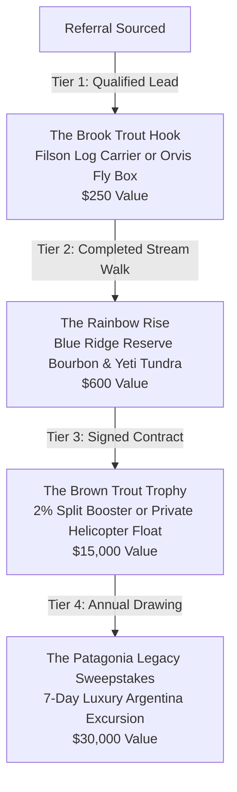

# File 47: Crisp-Inspired High-Growth Marketing & Aspirational Referral Playbook

> [!IMPORTANT]
> **Strict B2B Launch Policy**: In accordance with executive instructions, **no active outreach or cold emailing will be initiated at this stage**. This playbook, detailing the gamified incentive models, mastermind peer loops, annual stream summits, and cinematic authority-led content loops, is fully staged and ready for immediate campaign activation.

## I. Executive Overview: Sourcing Crisp.co's Growth Model

To drive rapid, organic growth for Blue Ridge Stream Restoration & Mitigation LLC, we adapt the highly successful B2B growth marketing and community-led frameworks pioneered by **Crisp (crisp.co)**. Under Managing Director Michael Mogill, Crisp scaled from a boutique video production startup into a $100M+ market-leading legal coaching and growth conglomerate. 

Instead of relying on standard low-yield B2B cold calling, digital banner ads, or minor discount referrals, Crisp's growth engine focuses on four core pillars:
1. **High-Stakes, Tiered Aspirational Incentives**: Gamifying referrals by offering ultra-desirable, high-status rewards that tap into the competitive drive and prestige of their target audience.
2. **Community-Led Mastermind Networks**: Establishing exclusive peer circles where top-performing clients hold each other accountable, share geomorphic land successes, and actively refer regional peers.
3. **The "Unreasonable Hospitality" Sourcing Loop**: Delivering immediate, friction-free value (books, private-label goods, tailored tools) before a transaction is even discussed.
4. **Authority-Led Cinematic Content Loop**: Sourcing high-production-value video storytelling that transforms technical services into powerful, emotional legacy transformations.

By implementing this framework, Blue Ridge Stream Restoration will establish a powerful word-of-mouth engine among North Georgia's elite mountain landowners, conservation lawyers, and agricultural bankers.

---

## II. The Blue Ridge High-Stakes Tiered Incentive Ladder

To gamify our B2B and landowner referral loops, we discard small cash commissions and replace them with a structured, **High-Stakes Aspirational Referral Ladder**. This system provides immediate gratification for low-friction leads, mid-tier physical rewards for completed assessments, and highly desirable grand prizes for signed contracts:



### Tier 1: "The Brook Trout Hook" (Low-Friction Sourcing Trigger)
- **The Trigger**: A partner (lawyer, banker, land trust manager, or existing landowner) submits a qualified referral consisting of a Georgia landowner's name, verified phone/email, and a geomorphic description of an eroding stream reach ($\ge 50$ acres, $\ge 1,000$ LF of stream channel).
- **The Incentive**: Upon verification of the geomorphic coordinates (with zero sales calls initiated), Blue Ridge immediately ships an elite outdoor accessory to the referring partner:
  - *Option A*: A rugged, water-resistant **Filson Rugged Twill Log Carrier** (leather handles, River Navy color) branded with the embossed Blue Ridge brass seal.
  - *Option B*: A custom-curated **Orvis Waterproof Fly Box** loaded with 24 premium, hand-tied local trout flies (Parachute Adams, Copper Johns, Pheasant Tails) selected for North Georgia mountain streams.
- **The Psychology**: Immediate gratification. The referrer receives a high-end, tangible reward within 5 business days of submission, building immediate trust and low-friction motivation.

### Tier 2: "The Rainbow Rise" (Completed Assessment Trigger)
- **The Trigger**: The referred landowner agrees to and completes a geomorphic "stream walk" assessment with Managing Director Hunter Morris.
- **The Incentive**: Once the stream walk is completed, the referring partner receives:
  - A custom-branded **Yeti Tundra 45 Cooler** (Trout Teal color) featuring the Blue Ridge logo.
  - Tucked inside the cooler is a bottle of **Blue Ridge Reserve single-barrel Bourbon** (private-label, aged 10 years in charred white oak barrels) paired with two hand-blown mountain peaks whiskey glasses.
- **The Psychology**: Professional pride and social proof. The referrer has connected their peer with immediate technical value, and receives a highly visible, premium lifestyle asset that serves as a permanent conversation starter.

### Tier 3: "The Brown Trout Trophy" (Signed JV Contract Trigger)
- **The Trigger**: The referred landowner executes a legally binding 70/30 Joint-Venture Mitigation Banking Agreement with Blue Ridge.
- **The Incentive**: The referring partner is granted a choice of one of three high-value assets:
  - *Option A (Capital Booster)*: The **2.0% JV Split Booster** (adding $28,380 USD to their project's gross payout).
  - *Option B (On-Site Civil Upgrades)*: The **Premium Civil Upgrades** constructed entirely at our cost (spawning stream, timber bridge, or cedar pavilion).
  - *Option C (The Private Helicopter-Wade Float)*: A fully hosted, elite fly-fishing adventure for two. A private helicopter charters the partner directly from Atlanta to the deep-canyon headwaters of the Toccoa River or Chattooga River. Includes 2 days of guided trophy-trout wades, professional outfitting, and full luxury catering.

### Tier 4: "The Patagonia Legacy Sweepstakes" (The Annual Grand Prize)
- **The Trigger**: For every successful JV Closing referred during the calendar year, the referring partner receives one (1) entry into our **Annual Grand Legacy Sweepstakes**.
- **The Incentive**: On December 15th of each year, Blue Ridge holds a live drawing at our Legacy Stream Summit. One winner is selected for an all-expenses-paid, 7-day ultra-luxury **Patagonia Fly-Fishing Excursion for Two in Argentina**:
  - *Private Estancia*: 6 nights of premium lodging at a private estancia on the banks of the Chimehuin River.
  - *Elite Guides*: Full-day drift boat guided fly-casting targeting legendary, wild Patagonia brown trout.
  - *Elite Gear*: Complete set of custom-fitted Sage fly-rods, Ross reels, and Simms wading gear provided as a permanent gift.
  - *Commercial Value*: **30,000 USD** (Fully underwritten under Blue Ridge's strategic B2B marketing budget).
- **The Psychology**: The ultimate aspirational hook. Mapped directly onto Crisp's famous Tesla drawing, this premium sweepstakes drives a constant stream of high-quality introductions, as every partner strives to secure multiple entries.

---

## III. The Blue Ridge Conservation Mastermind & Legacy Club

Adapting Crisp's high-ticket mastermind coaching program, we establish the **Blue Ridge Conservation Mastermind & Legacy Club**. This is an invite-only peer circle composed of North Georgia's elite trout estate owners, environmental attorneys, agribusiness relationship bankers, and land trust directors.

### 1. Peer Accountability & Stewardship Rhythms
- **The Concept**: Members are positioned not just as clients, but as the vanguard of Georgia's ecological preservation. 
- **The Rhythms**:
  - *Bi-Monthly Roundtable Dinners*: Hosted at premium mountain venues (e.g., The Blue Ridge Lodge, Smithgall Woods), featuring guest speakers on geomorphic bioengineering, conservation hydrology, federal RIBITS ledgers, and exurban land planning.
  - *Spring Trout Stocking Days*: Members gather to participate in the physical release of native trout fingerlings into newly restored channels, creating an immersive, hands-on conservation connection.

### 2. The Referral "Ambassador" Loop
- By framing membership around status, legacy, and land stewardship, we tap into community pride. Mastermind members actively advocate for Blue Ridge Stream Restoration, introducing our geomorphic solutions to their exurban property networks, estate planning clients, and developer portfolios.

---

## IV. The "Legacy Stream Summit" (Annual Sourcing Event)

To institutionalize our B2B network, Blue Ridge hosts the **Annual Legacy Stream Summit** at Smithgall Woods State Park or a private mountain lodge in Blue Ridge, Georgia. This event brings together all three pillars of the mitigation market:

```text
================================================================================
                           THE LEGACY STREAM SUMMIT
             "Bridging Land Sourcing, Law, and Mitigation Capital"
================================================================================
[ Land Trust Directors ]   [ Private Landowners ]   [ ESG Data Center Directors ]
[ Conservation Lawyers ]           |                [ Infrastructure Planners ]
          \                        |                        /
           \                       v                       /
            ------> [ Unified B2B Mitigation Network ] <------
================================================================================
```

### 1. Key Summit Objectives
- **Connect Sourcing with Capital**: Connect large landowners (who have the stream channels) directly with corporate ESG directors and industrial developers (who need the credits), showcasing Blue Ridge's geomorphic restoration as the connecting vehicle.
- **Provide Academic & Regulatory Authority**: Host panel discussions featuring our UGA, Georgia Tech, and Clemson Board of Advisors on the latest stream classification modeling, HEC-RAS storm modeling, and the economic yields of 70/30 JV structures.
- **Drive Aspirational Action**: Conduct live drawings for the Patagonia Legacy Sweepstakes and present "Legacy Stewardship Awards" to landowners who have stabilized their river buffers, creating massive social proof for attending prospects.

---

## V. Cinematic Trout Legacies (Authority Video Sourcing)

Crisp's ultimate growth driver is premium, high-impact cinematic video storytelling. We adapt this by launching the **Cinematic Trout Legacies Video Campaign**:

### 1. The Video Blueprint
- **The Narrative Arc**: Instead of dry technical engineering videos, every case study is treated as a premium, emotional documentary profiling the landowner and their creek:
  - *The Challenge*: Showing severe vertical bank erosion, lost pasture acreage, muddy water, and empty spawning gravels.
  - *The Geomorphic Intervention*: Capturing heavy excavation John Deere equipment placing massive cedar root-wads, shaping pools, and geogrid soil stabilization.
  - *The Legacy Restored*: High-definition aerial drone footage of crystal-clear water, active trout spawning runs, family members walking across a timber arch bridge, and the landowner receiving their first credit revenue check.
- **B2B Slicing**: These premium videos are sliced into short 60-second clips for Hunter's LinkedIn campaign (File 10), distributed directly to exurban real estate brokers, and hosted on our dynamic operations portal.

---

## VI. Sourcing Outreach Template: Introducing the Sweepstakes

*This outreach template is staged to introduce B2B bankers, lawyers, and land trust directors to the tiered incentive program and the Patagonia Sweepstakes.*

```email
Subject: Strategic Partnership: Trophy Trout Incentives & Client Land Monetization
To: [Partner_Email]

Dear [Partner_Last_Name],

I hope you are having a productive week. My name is Hunter Morris, Managing Director of Blue Ridge Stream Restoration LLC.

We partner with relationship lenders, timber managers, and estate planning attorneys across Georgia to monetize degraded, non-buildable stream buffers. Using geomorphic bioengineering, we restore eroding creeks at zero upfront cost to the owner, yielding lucrative stream mitigation credits under the Clean Water Act. 

To support our B2B partners who connect us with qualified landowner leads, we operate the Blue Ridge Aspirational Referral Program. Submitting a qualified lead (Georgia landowner with >= 50 acres and >= 1,000 LF of degraded stream buffer) immediately secures a premium Filson Twill Log Carrier or custom Orvis Fly Box. 

Furthermore, if the referral leads to a successful Joint-Venture contract, you are eligible for a 2.0% gross credit sales affiliate fee, a premium timber bridge crossing for your own land, or an entry into our Annual Grand Legacy Sweepstakes—drawing for an all-expenses-paid, 7-day luxury fly-fishing excursion for two to Patagonia, Argentina.

I would welcome the opportunity to host you for a brief introductory lunch or virtual meeting next week to share our standard landowner 70/30 JV model and discuss how we can serve as a premium asset to your professional network.

Sincerely,

Hunter Morris
Managing Director
Blue Ridge Stream Restoration & Mitigation LLC
hunter@blueridgestream.us.kg
```
